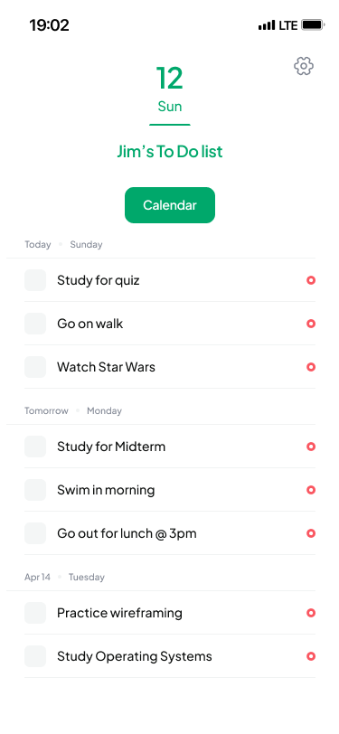
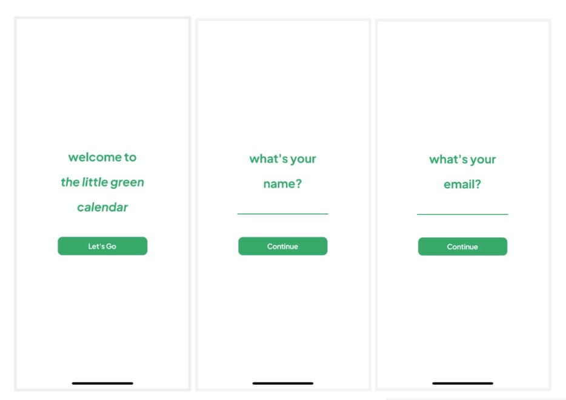
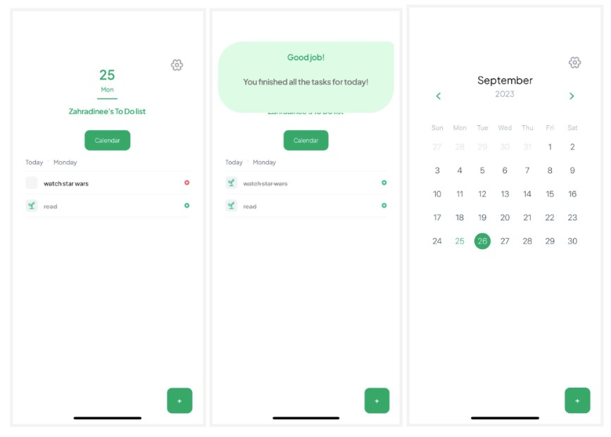

# the little green calendar



A delightful calendar and to-do list app to help you stay organized and on top of your schedule - created especially for those with ADHD.

## ⚠️ Under Development

🚧 This project is currently under active development.

## Features

- **Intuitive Interface**: User-friendly design for easy navigation and interaction. Minimalist approach with simple layout for a distration-free enviornment.
- **Calendar View**: Plan your days, weeks, and months at a glance.
- **To-Do List**: Manage your tasks efficiently with a dedicated to-do list.
- **Reminders**: Set reminders for important events and tasks.
- **Completion Notifications**: Recieve a banner notifying that you've finished all the tasks from today!

## Screenshots

  
*Signing in and getting started with the app*

  
*Scheduling tasks and viewing the calendar*

## Getting Started

To start using the little green xalendar, follow these steps:

1. Clone the repository:

   ```bash
   git clone https://github.com/your-username/little-green-calendar.git
